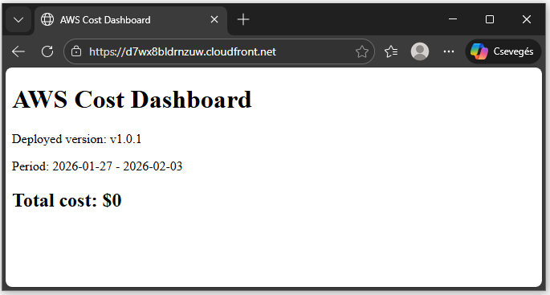
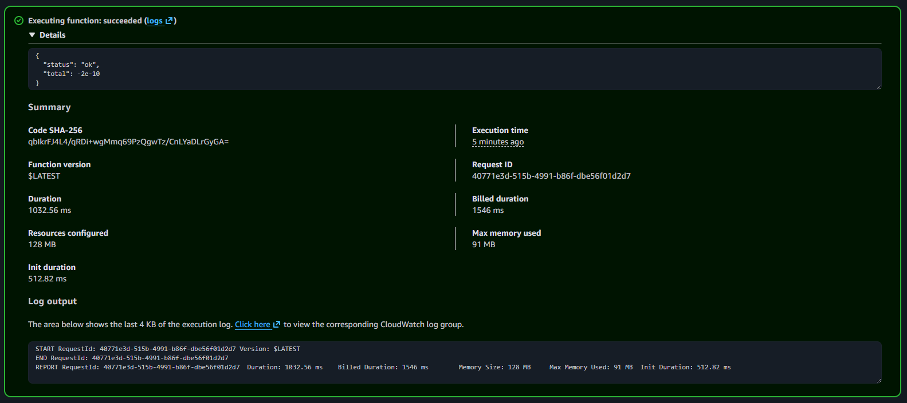
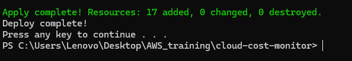
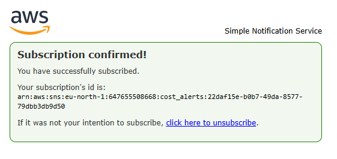
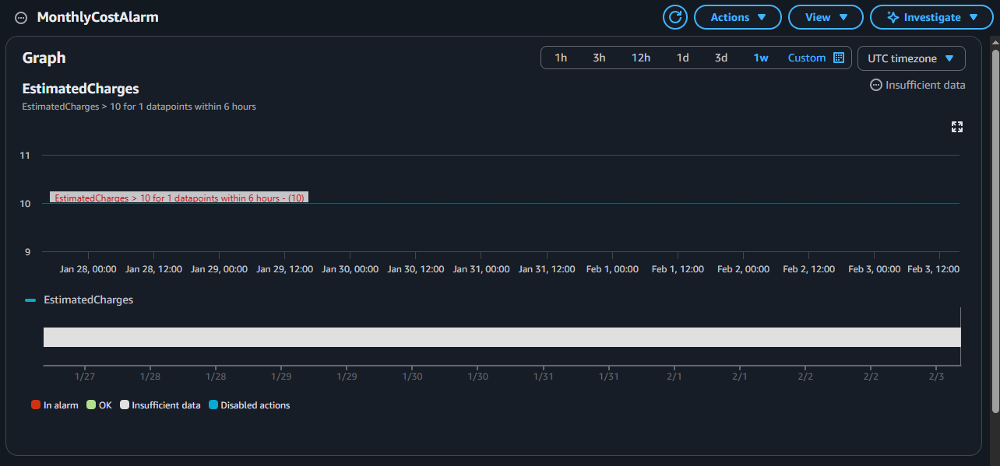

# AWS Cloud Cost Monitor

A production-style cloud project that monitors AWS spending, sends alerts, 
generates weekly reports, and displays them on a secure static dashboard.

---

## 🚀 What this project does

- Monitors AWS billing metrics
- Sends email alerts when costs exceed a threshold
- Generates weekly cost reports using Lambda
- Displays data on a secure CloudFront dashboard
- Fully automated with Terraform
- One-click deployment with a script

This project demonstrates real-world cloud cost optimization and automation.

---

## 🧩 Architecture Overview

**AWS Services used:**

- CloudWatch – billing metrics & alarms  
- SNS – email notifications  
- Lambda – weekly report generator  
- Cost Explorer API – retrieves cost data  
- S3 – private dashboard storage  
- CloudFront – secure public access  
- Terraform – infrastructure as code  

Flow:
CloudWatch → SNS → Lambda → Cost Explorer → S3 → CloudFront → Browser

---

## 💰 Cost Estimation (Free Tier vs Real-World)

🔹 Assumptions

- 1 Lambda script / week
- 1 CloudWatch alarm
- 1 SNS email notification
- 1 CloudFront distribution
- ~1,000 dashboard view / month
- ~50 MB static content

🆓 Free Tier

| Service    | Est. Monthly Cost |
|------------|-------------------|
| Lambda     | $0 (free tier)    |
| SNS        | $0 (low volume)   |
| CloudWatch | $0–$1             |
| S3         | <$0.10            |
| CloudFront | <$0.50            |

**Total:** ~$0–$2 / month

🏢 Real-World (no free tier, small business scale)

| Service                                | Est. Monthly Cost |
|----------------------------------------|-------------------|
| Lambda (4 runs/month)                  | ~$0,01            |
| SNS (emails + SMS optional)            | ~$1-$3            |
| CloudWatch metrics + alarm             | ~$2–$4            |
| S3 (1GB storage)                       | ~$0.02            |
| CloudFront (1,000 req + 1 GB transfer) | ~$0.10-$1         |

👉 Estimated total: $5–$10 / month


🏭 Scaling scenario (startup / SaaS)

| Scenario                  | Est. Cost |
| ------------------------- | --------- |
| 10k dashboard views/month | ~$15–$25  |
| 100k views/month          | ~$50–$80  |


This project is designed to be cost-efficient.
At small business scale, the estimated monthly cost is $5–$10, while still providing enterprise-style monitoring and alerting.

---

## ⚙️ Prerequisites

- AWS account
- AWS CLI configured
- Terraform installed
- PowerShell (Windows)
- Python 3 in PATH
- Cost explorer visited in AWS (currently it needs 24h to activate)

---

## 🚀 How to Deploy

```powershell
aws configure
deploy.bat
```

This will:

1. Update index.html version (for CloudFront cache invalidation)
2. Package Lambda
3. Apply Terraform
4. Publishes the dashboard to S3 and serves it securely through CloudFront.
NOTE: it does not run the lambda script during deploy, it runs automaticly weekly.

## 🧠 How it works

1. CloudWatch tracks billing
2. Alarm triggers SNS on threshold
3. Lambda queries Cost Explorer weekly
4. Result is stored as JSON
5. Dashboard fetches JSON and displays it

## 🧪 Health Check

- The dashboard shows a version string.
- Each deploy increments the version.
- If it changes, CloudFront is serving the newest content.

## 🧩 Challenges & Learnings

- Learned Terraform resource dependencies
- Solved security issues with CloudFront + private S3 access
- Implemented free and automated cache-busting strategy
- Understood AWS billing APIs

## 📸 Screenshots







## 🎓 Certifications


## 👤 Author

László Banréti
Aspiring Cloud Engineer